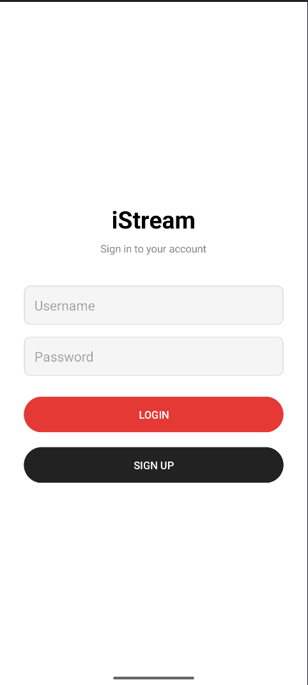
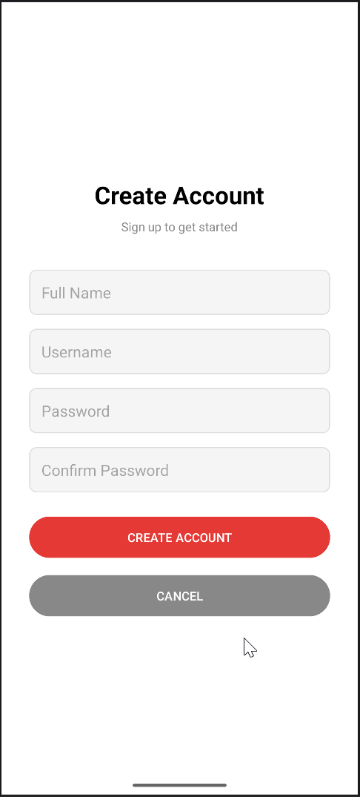
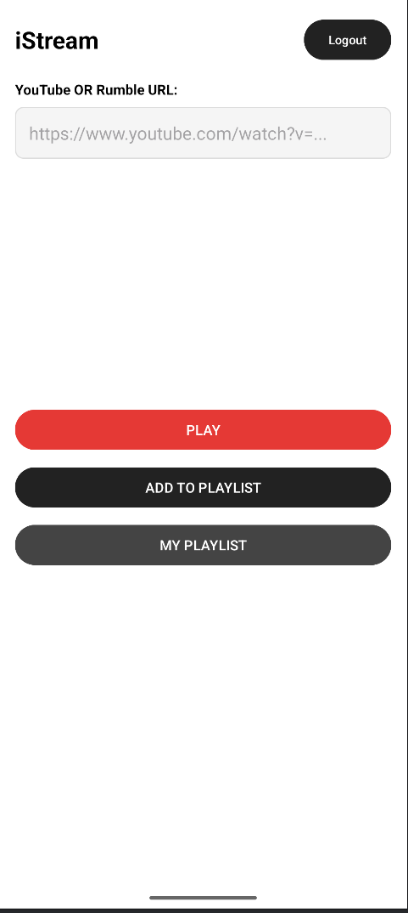
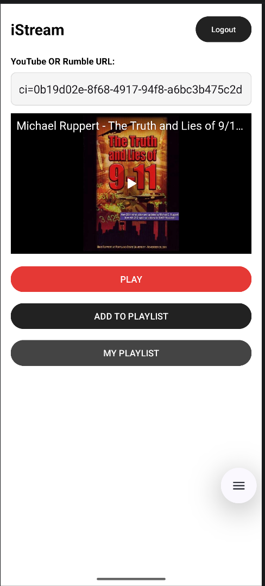
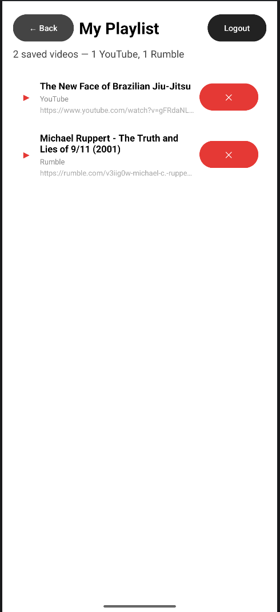

# iStream — Video Playlist App
### SIT305 Task 5.1C Subtask 2

---

## Overview
iStream is an Android application developed as part of SIT305.  
The app demonstrates user authentication, local database management using Room, and embedded media playback using a WebView-based player.

The application supports multiple video sources, including YouTube and Rumble, and follows a structured architecture with clear separation between UI, data, and persistence layers.

---

## Features

### Authentication
- Login screen with username and password validation  
- Sign up functionality with duplicate username checks  
- User credentials stored locally using Room database  

### Video Playback
- Accepts video URLs (YouTube and Rumble)  
- Extracts and processes video identifiers dynamically  
- Loads content using iframe embeds within a WebView  
- WebView configured with JavaScript, DOM storage, and WebChromeClient for media playback  

### Playlist Management
- Users can save video URLs to a personal playlist  
- Each playlist is scoped to the logged-in user via `userId`  
- Playlist items stored in local Room database  
- RecyclerView used to display saved videos  

### Navigation
- Login → Home → Playlist flow  
- Logout returns user to Login screen  
- Intent-based navigation between activities  

---

## Screenshots

| | | |
|---|---|---|
|  |  |  |
| **Login** | **Signup** | **Home** |
|  |  |  |
| **Playing** | **Playlist** | **Empty Playlist** |

## Technical Implementation

### Architecture
- Activity-based navigation with clear separation of concerns  
- Package structure:
  - `model` → Room entities  
  - `database` → DAO and database layer  
  - UI activities for user interaction  

### Database (Room)
- Entities:
  - `User`
  - `PlaylistItem`
- Relationship:
  - One-to-many via `userId`  
- DAOs:
  - `UserDao` for authentication  
  - `PlaylistDao` for playlist operations  

### Media Handling
- YouTube: iframe embed with dynamic video ID extraction  
- Rumble: iframe embed using direct URL input  
- WebView configured with:
  - JavaScript enabled  
  - DOM storage enabled  
  - WebChromeClient for video playback  

---

## What I Learned / Design Decisions

### YouTube vs Rumble Playback
YouTube videos initially failed in WebView (error 152/4), while Rumble worked without issue.  
This highlighted that YouTube enforces stricter iframe and origin policies in embedded environments.

The fix involved simplifying the iframe and removing conflicting parameters, ensuring compatibility within WebView.

---

### Why WebView
WebView was used to implement iframe-based playback, aligning with the task requirements and avoiding unnecessary external APIs.  
It also allowed support for both YouTube and Rumble using a consistent approach.

---

### Room Database Design
The app uses two entities:
- `User`
- `PlaylistItem` (linked via `userId`)

This creates a one-to-many relationship, ensuring each user has an isolated playlist.

---

### Trade-offs
- Used `allowMainThreadQueries()` for simplicity  
- Basic validation handled in logic  
- WebView chosen over more complex media frameworks  

---

### Key Takeaway
User Input → Validation → Room → UI → Media Playback  

The project also highlights handling platform-specific behaviour rather than assuming consistent media embedding across providers.

---

## How to Run

1. Clone the repository  
2. Open in Android Studio  
3. Sync Gradle  
4. Run on emulator or physical device  

---

## AI Declaration

This project was developed with assistance from AI tools, specifically Claude AI (Anthropic).

AI was used for:
- Code scaffolding and structural setup  
- Debugging support (WebView behaviour, Room configuration, XML issues)  
- Clarification of Android components and lifecycle flow  

In addition, all user interface and user experience design decisions — including layout structure, navigation flow, and feature behaviour — were independently designed and implemented by the author.

All outputs were reviewed, validated, and modified before implementation.  
The final application reflects independent decision-making, debugging, UI/UX design ownership, and iterative refinement.

---

## Legal Disclaimer

This project is developed for educational purposes only.  
All code and implementation must not be reused, reproduced, or distributed without explicit authorisation from the author.